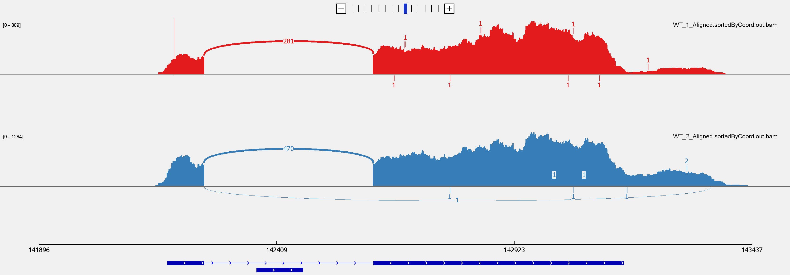

# Inspecting BAM Files

## Q1 

1. Download the Integrative Genomics Viewer from the Broad Institute. Download 2 BAM files from the Gierlinski data set to your computer and load them into the IGV Browser. Find a gene with at least one intron, take a Sashimi plot and explain what you see. 

We first download the version of IGV for Windows with Java included from https://software.broadinstitute.org/software/igv/download for the assignment. We then used WinSCP to download the WT_1_Aligned.sortedByCoord.out.bam, WT_1_Aligned.sortedByCoord.out.bam.bai, WT_2_Aligned.sortedByCoord.out.bam and WT_2_Aligned.sortedByCoord.out.bam.bai files to the computer to be used with IGV. IGV needs the .bai files as well as the .bam files and they must be named the same with just the extension .bai different. They must also be in the same folder so that IGV can find the .bai corresponding to the .bam. 

We then open IGV, change the current genome from hg19 to S. cerevisae (sacCer 3), click File -> Load from File -> Open the .bam files into the tool. Below we show a screenshot of the Sashimi plots, which we created by right clicking on the panel and clicking on Sashimi plot and selecting both samples, which contains a gene called EFB1 with introns. 

```{r}

```

This is showing a visualization of splice junctions for the WT1 replicates from their alignment data along side genomic coordinates. They show extremely similar results, which is to be expected, since they are replicates of the same sample. The coverage for each alignment track is plotted as a bar graph. Arcs representing splice junctions connect exons. Arcs display the number of reads split across the junction (junction depth). Genomic coordinates and the gene annotation track are shown below the junction tracks. We see that there is one splice junction for this gene. 

# Understanding Read Counts

## Q1

1. Describe the difference between how TPM and rlog values are calculated and what the consequences for their interpretation may be.

Both TPM and rlog are expression units. TPM stands for transcripts per kilobase million and is calculated by dividing the read counts by the length of each gene in kilobases (resulting in the Reads Per Kilobase (RPK)), counting up all the RPK values in a sample and dividing this number by 1,000,000 (giving the "per million" scaling factor), and dividing the RPK values by the “per million” scaling factor. When using TPM, the sum of all TPMs in each sample are the same. This makes it easy to compare the proportion of reads that mapped to a gene in each sample. rlog values are calculated by first normalizing for differences in sequencing depth and sample composition by taking the median of the ratios of the j-th sample's counts to those of the mean expression of each gene across all samples (called the size factor). Next, we take the log2-transform to compact the range of the values and bring their distribution closer to that of a normal distribution. Finally, there is a variance-stabilizing step which alleviates heteroskedasticity of the normalized read counts. These steps result in good proxies of the real expression strength of a given gene across different samples and should be use for exploratory analyses. The rlog calculated values are more reliable for exploratory analyses than the TPM values because they account for normalization across all samples, use the log function to make the data distribution normally distributed for statistical testing, and take into account heteroskedasticity. 

## Q2

2. What is the main difference between exploratory analyses and the tests for differential gene expression in terms of the types of questions that can be addressed with either one?

The main difference between exploratory analyses and the tests for differential gene expression in terms of the types of questions that can be addressed with either one is that exploratory analyses allow us to discover biases and unexpected variability, resulting in understanding the data through visualizations and variance reducing techniques. Differential gene expression allows us to test a null hypothesis that there is no difference in the read distribution between two conditions, resulting in the the ability to estimate the magnitude of differential expression using log fold change and the significance of the difference of the differential expression.

## Q3

3. Exploratory analyses of DESeq.ds objects: generate a dendrogram and a PCA plot of our 10 samples and briefly explain the major insights you can derive from them. You may use the code detailed in  the document, but make sure to explain what every (!) function does and what type of output each function generates. Can you infer what the pcaExplorer plots of the “Top Loadings” represent?

To create a dendrogram and PCA plot, we first import the libraries we need to use.

```{r, results='hide'}
library(DESeq2)
library(magrittr)
library(ggplot2)
```

Next, we load the DESeq2 object and the rlog-transformed values that we generated previously from the class notes.

```{r}
load("C:/Users/nicky/OneDrive/Documents/ANGSD-R-In_Class/2-24/RNAseqGierlinski.RData")
ls()
```

Below we follow the practical given for this assignment and use the pheatmap package to generate a clustered heatmap of correlation coefficients. The second line below in which the pearson correlation coefficient matrix is created is a necessary step in order to create the dendrogram also.

```{r}
# install.packages('pheatmap')
corr_coeff <-cor(rlog.norm.counts, method = "pearson")
as.dist(1-corr_coeff, upper = TRUE) %>% as.matrix %>% pheatmap::pheatmap(., main = "Pearson correlation")
```

Below we plot two dendrograms, comparing the effects of the rlog transformation to that without it. The code below begins with the formatting for the output plots using par(). Next, the pearson correlation coefficient matrix values are all subtracted from 1 and the output is a dissimilarity structure. This is then hierarchically clustered using hclust. Initially, each object is assigned to its own cluster and then the algorithm proceeds iteratively, at each stage joining the two most similar clusters, continuing until there is just a single cluster. At each stage distances between clusters are recomputed by the Lance--Williams dissimilarity update formula according to the particular clustering method being used. In hierarchical cluster displays, a decision is needed at each merge to specify which subtree should go on the left and which on the right. Since, for n observations there are n-1 merges, there are $2^{n-1}$ possible orderings for the leaves in a cluster tree, or dendrogram. The algorithm used in hclust is to order the subtree so that the tighter cluster is on the left. This corresponds to the SNF2 samples in our case. The output below shows us that in both cases, there is still a separation using hierarchical clustering between the SNF2 and WT samples. However, the rlog transformed data results in a small change of order of the hierarchy for the SNF2 samples compared to that of the non-rlog values. 

```{r}
par(mfrow=c(1,2))
# Pearson corr. for rlog.norm values
as.dist(1-corr_coeff) %>% hclust %>% plot( ., labels =colnames(rlog.norm.counts),main = "rlog transformed read counts")
# Pearson corr. for log.norm.values
as.dist( 1- cor(log.norm.counts, method = "pearson"))%>%hclust%>% plot( ., labels =colnames(log.norm.counts),main = "no rlog")
```

Next we make the PCA plot. Principal Component Analysis is typically done on the most variably detected genes, i.e. genes whose expression values change the most across samples. Take note that the matrix has to be flipped via the t() function in order to determine the eigenvectors based on the gene expression values. In the code below, the first line defines the variance estimates for each row in the DESeq matrix of the rlog values. The next line keeps the top 500 genes with the most variance. The pca line then performs pca on the these variances. We then show the first few values of the pca outcome using head(). Finally, PCA is run on the rlog values using the plotPCA() function and the output is shown below. The axes represent the first two principal components which explain 84% and 12% of the variance, and the graph shows a clear separation between the samples.

```{r}
rv <- rowVars(assay(DESeq.rlog))
# equivalent to rowVars(rlog.norm.counts)
top_variable <- order(rv, decreasing = TRUE)[seq_len(500)]
pca <- prcomp(t(assay(DESeq.rlog)[top_variable, ]))
head(pca$x)
plotPCA(DESeq.rlog)
```

pcaExplorer lets you interact with the DESeq2-based plots and analyses. It has included hierarchical clustering of samples and PCA. When running this command, a new window opens with a lot of information about the PCA and other analyses. Loadings range from -1 to 1, and the higher the numerical value of a gene's loading is, the more that gene means for the variance of the principal component in question. The pcaExplorer plots of the “Top Loadings” represent the most influential genes for the formation of a specific principal component.

```{r,eval=FALSE}
# BiocManager::install("pcaExplorer")
pcaExplorer::pcaExplorer(dds = DESeq.ds)
```


## Q4

4. What does the t() function do in the PCA code?

The t() function acts such that given a matrix or data.frame x, t(x) returns the transpose of x. Therefore, it functions to take the transpose of the rlog values. 


## Q5

5. What does the p-value calculated by DESeq2 represent? I.e., what could be the reason for a given gene to have a p-value close to zero or close to one?

The p-value calculated by DESeq2 represents the probability that the gene has a significantly different expression given our null hypothesis that there is no difference in the read distribution between the SNF2 and WT samples. A gene has a p-value close to zero if it its magnitude of DE differs significantly between the two samples and a p-value close to one if its magnitude of DE does not differ at all between the two samples.


## Q6 

6. Despite the fact that we are testing each gene individually, which calculations/values are influenced by the values of the other genes in the same matrix? Explain at least one. 

The calculation of the p-value is influenced by the values of the other genes in the same matrix. Since there are multiple genes, and we are testing each gene individually, the type I error for each individual test would be equivalent to the $\alpha$ value, which is usually set to 0.05. If we have 5,000 genes, then we will expect to have 0.05*5000 = 250 false positives, which is a lot. However, if we use Bonferroni correction, which accounts for the total number of tests and divides the $\alpha$ values by this number, then our type I error decreases and we can be more confident that our hits are truly significant. We must always adjust the p-value due to this problem.
